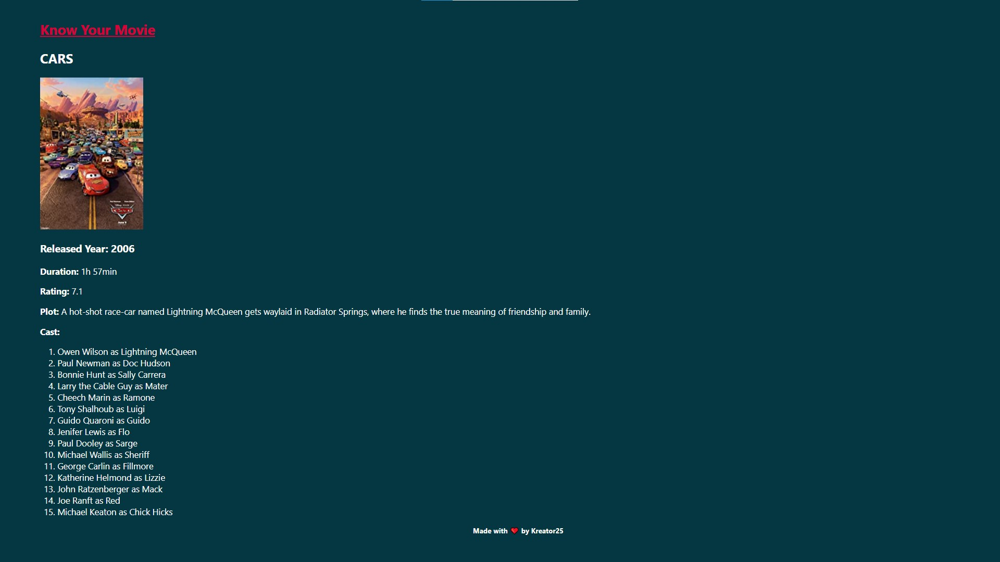

# Know Your Movie

A web app that gives you a brief info about the movie.
The details like duration, rating, plot, and cast are displayed.

## Screenshots




## Run Locally

Clone the project

```bash
  git clone https://github.com/Kushagra-Kapoor25/KnowYourMovie.git
```

Go to the project directory

```bash
  cd KnowYourMovie
```

Install dependencies

```bash
  npm install
```

Start the server

```bash
  nodemon app.js
```

## Environment Variables

To run this project, you will need to add the following environment variables to your .env file

`API_KEY`

`HOST_NAME`

## Feedback

If you have any feedback, please reach out to us at kushagrakapoor27@gmail.com

## Authors

- [@Kushagra-Kapoor25](https://github.com/Kushagra-Kapoor25)
